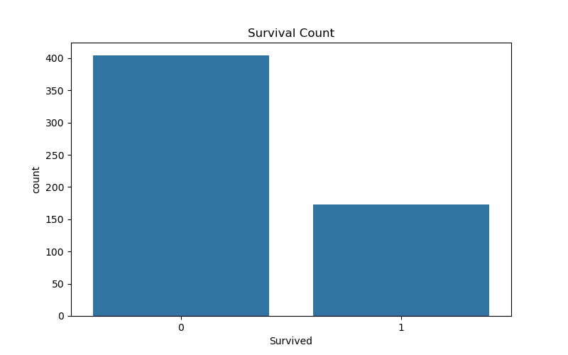
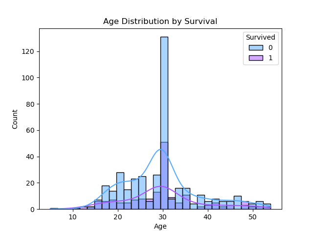
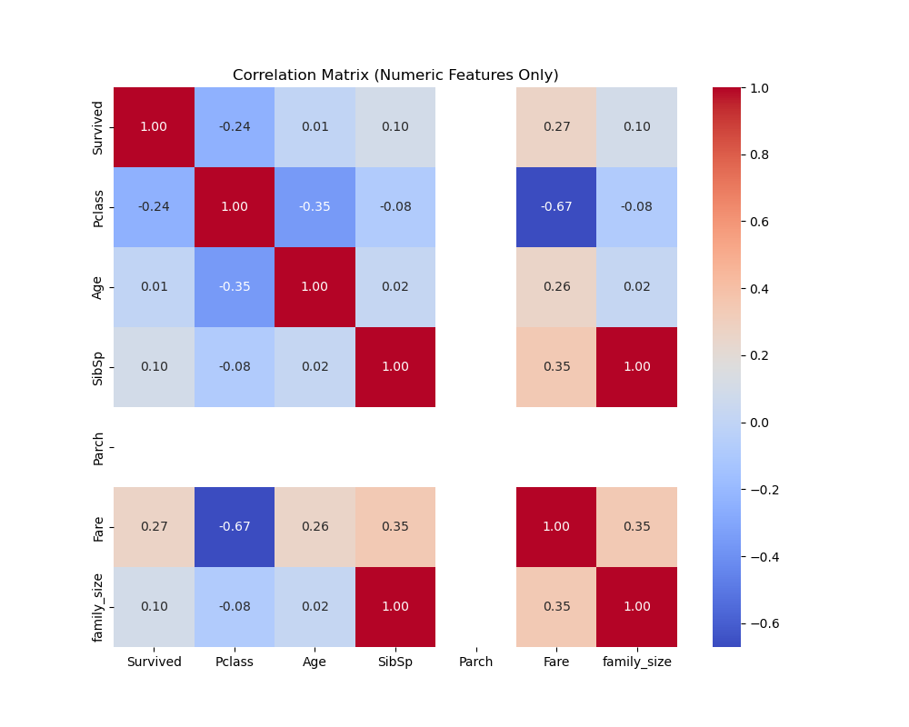
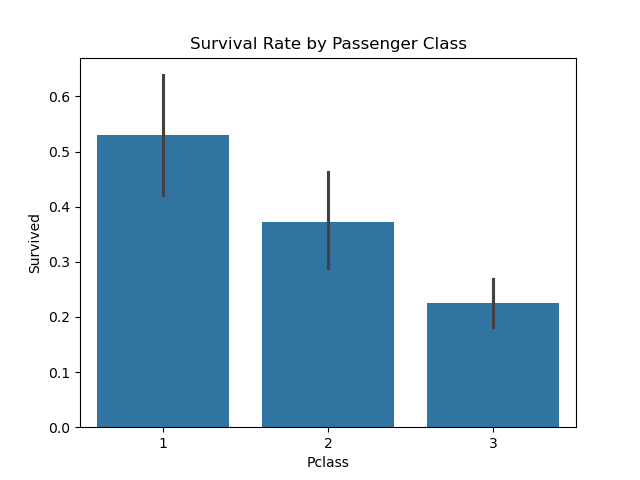

# 🚢 Titanic Dataset - Exploratory Data Analysis (EDA)

## 🧠 AI & ML Internship Project

This notebook performs an in-depth **Exploratory Data Analysis (EDA)** on the Titanic dataset. The goal is to understand the data better using statistics and visualizations, identify patterns that may influence survival, and build foundational insights for further machine learning work.

---

## 📌 Objective

- Understand data using summary statistics and visualizations
- Detect patterns, trends, and anomalies
- Gain experience with tools like Pandas, Matplotlib, Seaborn, and Plotly

---

## 🛠️ Tools & Libraries

- `pandas` for data manipulation  
- `numpy` for numerical operations  
- `matplotlib`, `seaborn` for static visualizations  
- `plotly` for interactive plots  

---

## 🔍 EDA Highlights

### 1. Summary Statistics
- Generated mean, median, standard deviation, and other descriptive statistics using `describe()`, `median()`, and `std()` functions.

### 2. Histograms & Boxplots
- Visualized feature distributions (e.g., Age, Fare) using histograms.
- Used boxplots to identify and understand outliers.

### 3. Correlation & Pairplots
- Created a heatmap to visualize relationships between features.
- Used `pairplot` to explore joint distributions and feature interactions.

### 4. Patterns, Trends, Anomalies
- Discovered survival was more likely among:
  - Females
  - Passengers in 1st class
  - Younger individuals
  - Passengers who paid higher fares
- Found outliers and skewed features (e.g., Fare)

### 5. Feature Inference
- Engineered new feature: `family_size` = `SibSp` + `Parch`
- Noted gender and class were strong predictors of survival

---

## 📈 Key Visuals

- 📊 Histograms of Age and Fare  
- 📉 Boxplots showing Fare distribution by survival  
- 🔥 Correlation Heatmap  
- 🧑‍🤝‍🧑 Barplot of Survival by Gender & Class  
- 🧠 Pairplots to study feature interactions  

---

## 🧠 Interview Preparation

### 🔸 What is the purpose of EDA?
EDA helps you understand a dataset’s structure, spot anomalies, detect patterns, and decide how to clean or engineer features before modeling.

### 🔸 How do boxplots help in understanding a dataset?
Boxplots reveal the spread of data, central values, and outliers — useful for detecting abnormal entries.

### 🔸 What is correlation and why is it useful?
Correlation measures the relationship between features. It’s crucial for identifying multicollinearity and useful predictors.

### 🔸 How do you detect skewness in data?
You can detect it using histograms or by using `.skew()` in pandas. A skew > 0 indicates right-skewed data.

### 🔸 What is multicollinearity?
Multicollinearity is when independent features are highly correlated, which can reduce model performance. It’s detected via correlation matrix or VIF.

### 🔸 What tools do you use for EDA?
Pandas, Matplotlib, Seaborn, and Plotly for visualization and analysis.

### 🔸 Can you explain a time when EDA helped you find a problem?
In this project, EDA helped identify missing age values and outliers in fare. These were handled through imputation and IQR filtering.

### 🔸 What is the role of visualization in ML?
Visualization helps communicate data insights clearly, validate assumptions, and support better feature selection and model building.

---
## 📈 Key Visuals

### 🔹 Survival Count

### 🔹 Age Distribution

### 🔹 Correlation Matrix

### 🔹 Survival by Gender

### 🔹 Survival by Class

---

## ✅ Conclusion

This notebook concludes the **Exploratory Data Analysis** phase of the Titanic dataset. The process involved cleaning, analyzing, visualizing, and drawing meaningful inferences to aid downstream ML tasks.

---