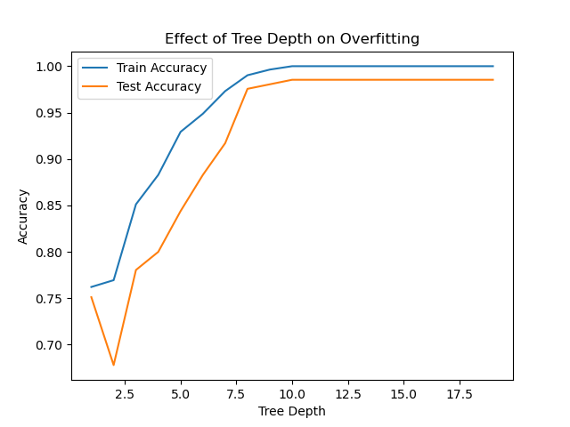
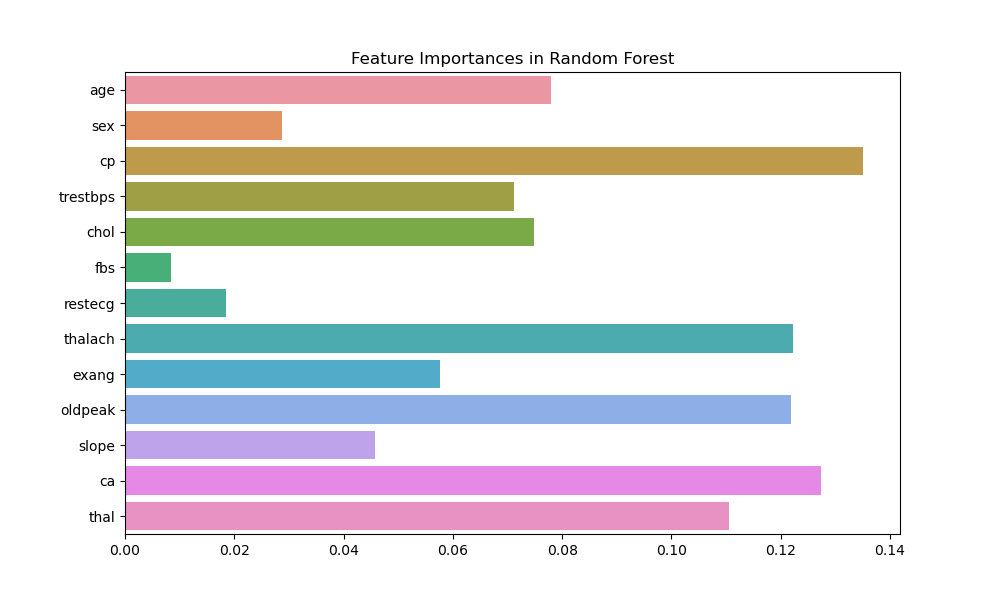

# 🧠 Decision Trees & Random Forests - Heart Disease Classification

## 📌 Objective

This project explores tree-based models—**Decision Trees** and **Random Forests**—for **classification** tasks using the **Heart Disease Dataset**. The goal is to predict whether a person has heart disease based on various health metrics.

---

## 🧰 Tools & Libraries Used

- Python
- Scikit-learn
- Pandas, NumPy
- Matplotlib, Seaborn
- Graphviz / `sklearn.tree.plot_tree`

---

## 📂 Dataset

- Dataset: [Heart Disease Dataset](https://www.kaggle.com/datasets/johnsmith88/heart-disease-dataset)
- Target Variable: `target` (1 = Disease, 0 = No Disease)
- Features: age, cholesterol, blood pressure, etc.

---

## 📊 Project Steps

### 1. Train a Decision Tree Classifier
- Trained a `DecisionTreeClassifier`.
- Visualized the decision tree structure using `plot_tree()`.

📷 **Decision Tree Visualization**  

---

### 2. Control Tree Depth to Prevent Overfitting
- Plotted train/test accuracy vs. tree depth.
- Helped identify optimal tree complexity.

📷 **Overfitting Analysis**  

---

### 3. Train a Random Forest
- Trained a `RandomForestClassifier` with 100 estimators.
- Achieved better generalization and accuracy compared to a single decision tree.

📋 **Random Forest Accuracy**  
Accuracy: 0.98
Precision: 0.97
Recall: 0.97
F1-score: 0.99

---

### 4. Feature Importance Analysis
- Visualized the most important features influencing heart disease prediction.

📷 **Feature Importances**  

---

### 5. Cross-Validation Evaluation
- 5-fold cross-validation used for robust evaluation.
- Decision Tree CV Accuracy: 1
- Random Forest CV Accuracy: 0.99

---

## ✅ Conclusion

- **Random Forest** outperformed Decision Tree in accuracy and generalization.
- **Feature importances** gave insights into the health indicators most associated with heart disease.
- Visualizing the tree and limiting its depth helps in combating **overfitting**.

---