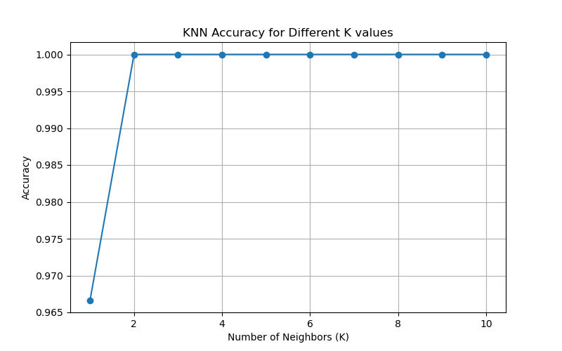
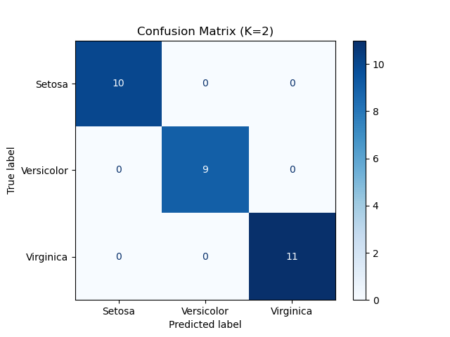
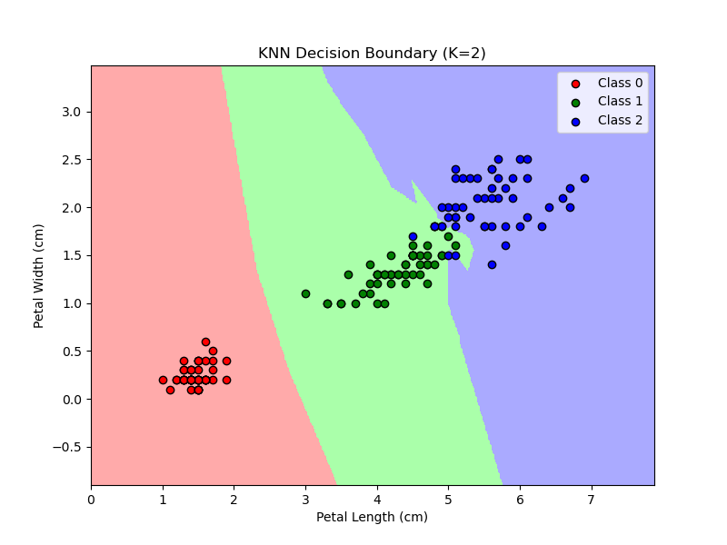

# 🧠 Task 6: K-Nearest Neighbors (KNN) Classification  
### 📚 AI & ML Internship Project

---

## 📌 Objective

Implement and understand the K-Nearest Neighbors (KNN) algorithm for a classification problem using the Iris dataset.

---

## 🛠️ Tools & Libraries Used

- Python  
- Scikit-learn  
- Pandas  
- Matplotlib  
- Seaborn  

---

## 📁 Dataset

Used the classic Iris dataset, which contains:

- **Features:** SepalLengthCm, SepalWidthCm, PetalLengthCm, PetalWidthCm  
- **Target:** Species (Iris-setosa, Iris-versicolor, Iris-virginica)

---

## 🧹 Preprocessing Steps

- Dropped the `Id` column.  
- Extracted features and target:

  ```python
  X = df.drop(['Id', 'Species'], axis=1)
  y = LabelEncoder().fit_transform(df['Species'])

- Normalized features using StandardScaler.
---

## 🧪 Model: K-Nearest Neighbors

- Used KNeighborsClassifier from sklearn.

- Split dataset into training and testing using train_test_split.

- Tested multiple values of K from 1 to 10.

- Evaluated model using accuracy score, confusion matrix, and decision boundaries.
---
## 📊 Results

✔📷 **Accuracy vs K**


✔📷**Confusion Matrix visualization**


✔📷 **Decision Boundary plot**


---
## 🎯 Final Observations

- Achieved 100% accuracy on the test set with K=3 and above.

- Clear class separation visible in the decision boundary plot.

- LabelEncoder efficiently mapped class labels to numerical form.

---

## ✅ Conclusion

KNN is a simple yet powerful classification algorithm. On the Iris dataset, it performs with high accuracy and produces intuitive decision boundaries.
