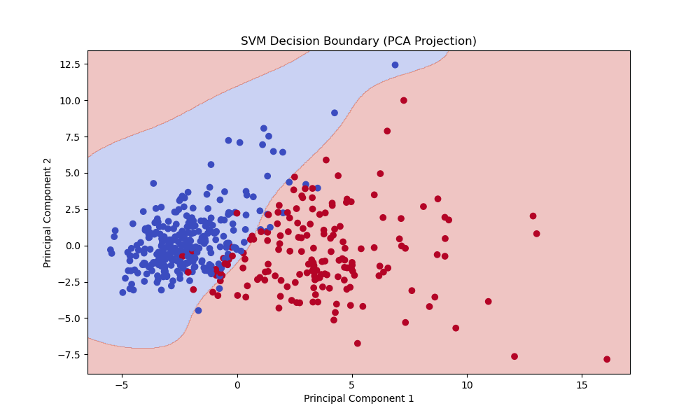

# 🧠 Task 7: Support Vector Machines (SVM)

This project is part of the AI & ML Internship. The objective of this task is to use Support Vector Machines (SVM) for both linear and non-linear classification on a real-world dataset.

---

## 📌 Objective

Implement and understand the Support Vector Machine (SVM) algorithm for binary classification using the Breast Cancer Dataset. Learn about margin maximization, kernel trick, and hyperparameter tuning.

---

## 🛠️ Tools & Libraries Used

- Python
- NumPy
- Pandas
- Scikit-learn
- Matplotlib
- Seaborn

---

## 📁 Dataset

- **Name**: Breast Cancer Dataset  
- **Source**: [Kaggle](https://www.kaggle.com/datasets/yasserh/breast-cancer-dataset)
- **Target Variable**: `Class`

---

## 📊 Steps Performed

1. Loaded and explored the dataset.
2. Preprocessed the features and applied standardization.
3. Split data into training and testing sets.
4. Trained:
   - Linear SVM
   - RBF Kernel SVM
5. Tuned hyperparameters (`C` and `gamma`) using GridSearchCV.
6. Visualized decision boundaries using PCA for dimensionality reduction.
7. Evaluated performance using classification report and accuracy.

---

## 📈 Results

- Both Linear and RBF kernels performed well with high accuracy.
- GridSearchCV helped in finding the optimal `C` and `gamma`.
- Visualizations showed clear decision boundaries on PCA-reduced data.

---

## 📷 Screenshots

### ✅ Decision Boundary (PCA Projection)

  

---

