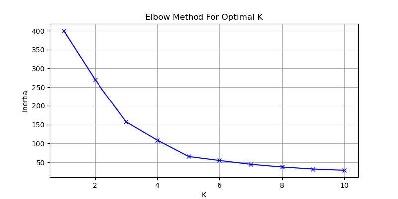
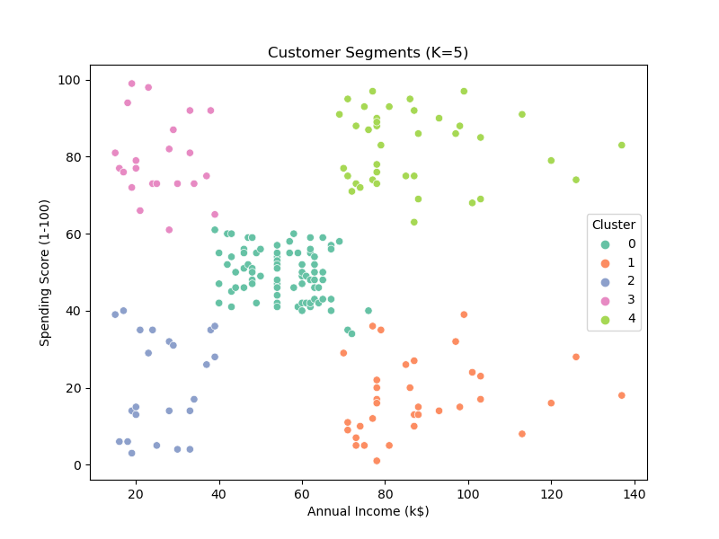

# 🧠 Task 8: Clustering with K-Means
### 📚 AI & ML Internship Project

## 📌 Objective
Perform unsupervised learning using **K-Means clustering** to segment customers based on income and spending patterns.

---

## 🛠 Tools & Libraries Used
- Python
- Pandas
- Scikit-learn
- Matplotlib
- Seaborn

---

## 🗂 Dataset
**Mall Customer Segmentation Dataset**  
📎 [Kaggle Link](https://www.kaggle.com/datasets/vjchoudhary7/customer-segmentation-tutorial-in-python)

---

## 🔍 What I Did
1. Loaded and explored the dataset.
2. Selected two key features: `Annual Income` and `Spending Score`.
3. Applied **StandardScaler** to normalize the data.
4. Used **Elbow Method** to determine optimal number of clusters (K).
5. Applied **KMeans** clustering (with K=5).
6. Visualized the clusters.
7. Evaluated with **Silhouette Score**.

---

## 📊 Visualizations

### Elbow Method

### Cluster Visualization

---

## 📈 Results
- **Optimal K:** 5
- **Silhouette Score:** _e.g._ 0.55 (depends on data randomness)

---